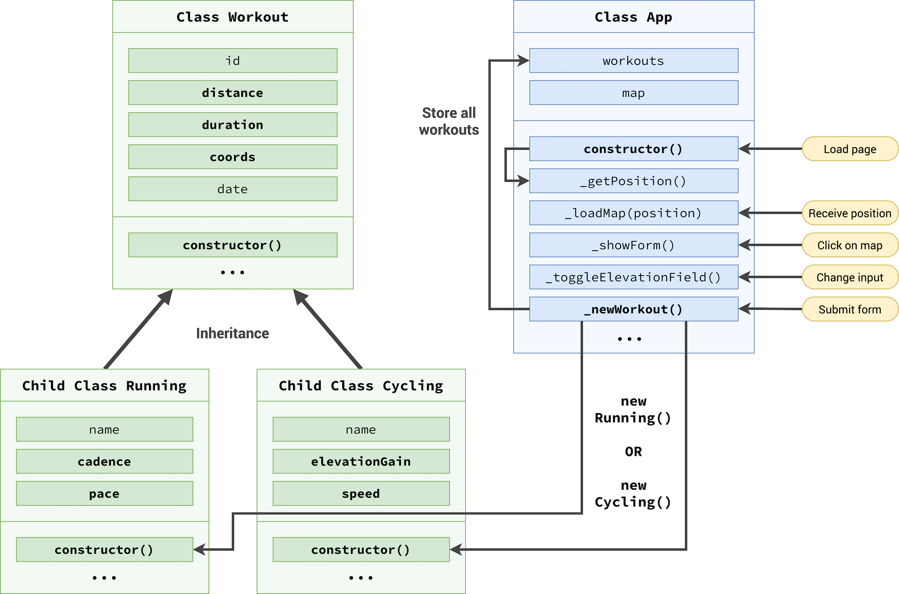

  
  <h2>Mapty</h2>
  
An activity tracker

  <!-- HTML -->
  

  <!-- CSS -->
  

  <!-- JAVASCRIPT -->
  

  <!-- MORE BADGES visit https://github.com/Ileriayo/markdown-badges -->

  <!-- REPO VIEWS -->
  
  <!-- WAKATIME -->
    

 

  <!-- BUY ME COFFEE -->
  

---

## References

### Flowchart

 

### Architecture

#### Part 1

 

#### Part 2

